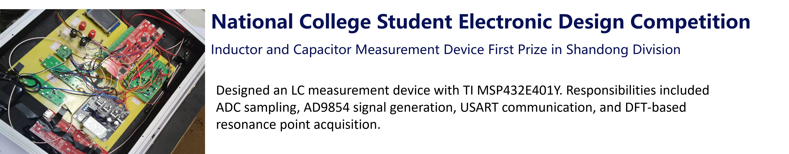
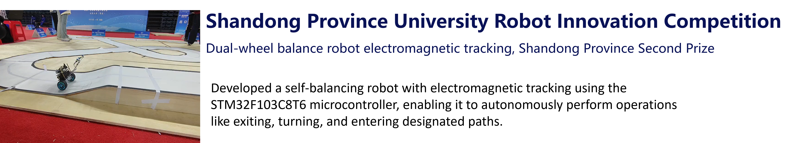
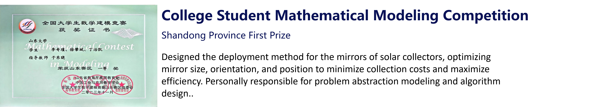
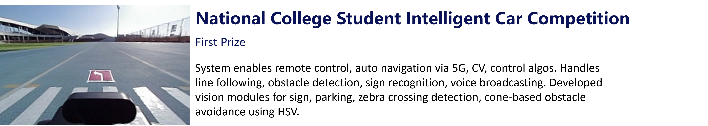
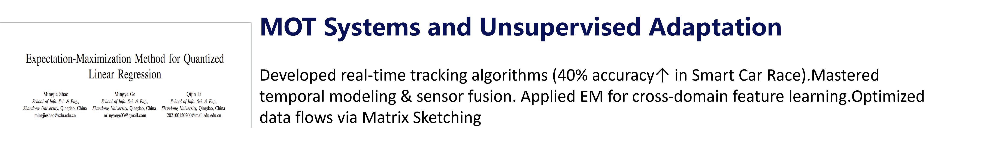
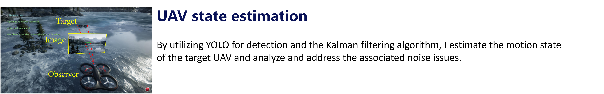
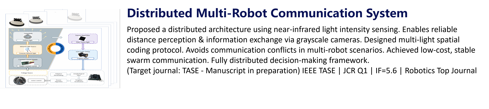

<!-- 
 -->
<!-- 
 -->
<!-- 
-->

# About Me

Here is **Qijin Li (李奇瑾)**.

I am a junior student studying in the School of Information Science and Engineering([**Chongxin College**](https://baike.baidu.com/item/%E5%B1%B1%E4%B8%9C%E5%A4%A7%E5%AD%A6%E5%B4%87%E6%96%B0%E5%AD%A6%E5%A0%82/20809738?fr=aladdin)), [**Shandong University**](https://www.sdu.edu.cn/) in China. I am also an Research Intern (2024 Summer - Present) at WindyLab, School of Engineering, Westlake University, supervised by Prof. Shiyu Zhao.

## Research Interests

My research interests are primarily in the fields of **multi-systems robot**, **UAV state estimation** and **statistical signal processing**. Specifically, my research goal is to develop near-infrared-based distributed multi-robot systems which are low-cost and stable in various environments. I am also working on UAV state estimation by utilizing YOLO for detection and Kalman filtering algorithms to estimate the motion state of the target UAV and address noise issues. In addition, I have experience in multi-target tracking and domain adaptation in statistical signal processing.
Prior to this, I have participated in a variety of competitions and projects, including the National University Students Intelligent Vehicle Competition, National College Student Electronic Design Competition, and Electronic Music Perpetual Calendar, which have given me hands-on experience in applying my skills to real-world scenarios.

If you are interested in any aspect of me, I would love to chat and collaborate, please email me at - *liqijin121[at]outlook[dot]com*.

## Academic Background

- **Apr 2024 - Present:** WLU (Visiting Student)
- **Sep 2021 - Present:** Shandong University (BSc, EECS)
<!--  -->

