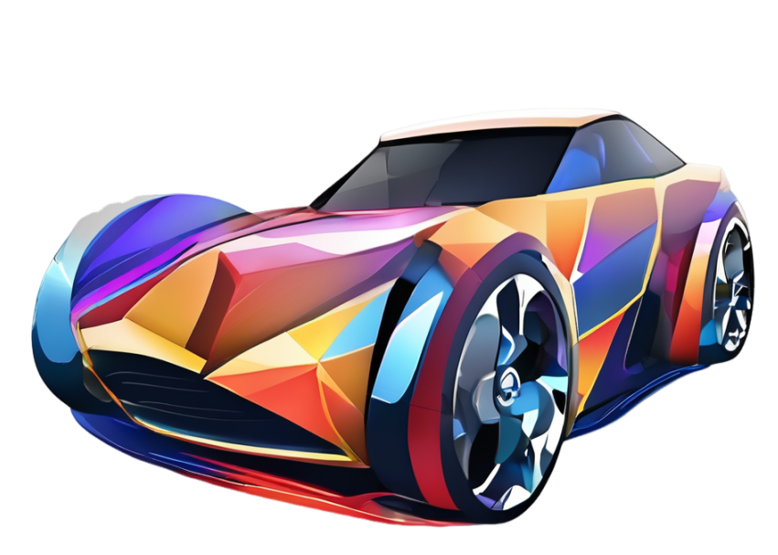

##  DRIVE: Dependable Robust Interpretable Visionary Ensemble Framework in Autonomous Driving

Songning Lai~, Tianlang Xue~, Hongru Xiao, Lijie Hu, Jiemin Wu, Ninghui Feng, Runwei Guan, Haicheng Liao, Zhenning Li, Yutao Yue†

HKUST(GZ), Tongji University, KAUST, University of Maca


[](https://NA) [](https://NA)  [](https://arxiv.org/0000.00000) 


**I'll show you GIFs or videos here**

### Abstract

Recent advancements in autonomous driving have seen a paradigm shift towards end-to-end learning paradigms, which map sensory inputs directly to driving actions, thereby enhancing the robustness and adaptability of autonomous vehicles. However, these models often sacrifice interpretability, posing significant challenges to trust, safety, and regulatory compliance. To address these issues, we introduce **DRIVE** -- **D**ependable **R**obust **I**nterpretable **V**isionary **E**nsemble Framework in Autonomous Driving, a comprehensive framework designed to improve the dependability and stability of explanations in end-to-end unsupervised autonomous driving models.
Our work specifically targets the inherent instability problems observed in the Driving through the Concept Gridlock (DCG) model, which undermine the trustworthiness of its explanations and decision-making processes. We define four key attributes of **DRIVE**: consistent interpretability, stable interpretability, consistent output, and stable output. These attributes collectively ensure that explanations remain reliable and robust across different scenarios and perturbations.
Through extensive empirical evaluations, we demonstrate the effectiveness of our framework in enhancing the stability and dependability of explanations, thereby addressing the limitations of current models. Our contributions include an in-depth analysis of the dependability issues within the DCG model, a rigorous definition of **DRIVE** with its fundamental properties, a framework to implement **DRIVE**, and novel metrics for evaluating the dependability of concept-based explainable autonomous driving models.
These advancements lay the groundwork for the development of more reliable and trusted autonomous driving systems, paving the way for their broader acceptance and deployment in real-world applications.


### Motivation

1. **Enhancing Public Trust**
   - Despite significant advancements in autonomous driving technology, public trust remains low due to concerns over loss of control and the lack of transparency in decision-making processes.
   - Achieving widespread commercial adoption necessitates developing systems that users can understand and trust.

2. **Addressing Black Box Issues**
   - Many current autonomous driving models, based on deep learning, function as black boxes, hindering interpretability and thus reducing confidence in their operations.
   - Post-hoc explanations, while attempted, fail to provide real-time insights into the decision-making process, highlighting the need for anticipatory explanations.

3. **Meeting Regulatory Requirements**
   - Regulations such as the EU's GDPR emphasize the right to explanation, underscoring the importance of transparent autonomous systems.
   - Meeting these legal requirements and ensuring that autonomous vehicles are dependable and interpretable is crucial for both regulatory compliance and fostering public acceptance.


### Contributions

1. **In-depth Analysis of DCG Dependability**
   - We identify and analyze a significant dependability issue in generating textual descriptions from visual data due to alignment instability between text and images, providing insights into the challenges of creating reliable and interpretable autonomous driving systems.
   
2. **Rigorous Definition and Properties of DRIVE**
   - We formally define the concept of **DRIVE** (Dependable Robust Interpretable Visionary Ensemble Framework in Autonomous Driving) and outline its four fundamental properties—consistent and stable interpretability, along with consistent and stable output—offering a structured approach to evaluate and enhance the explainability of autonomous driving models.
   
3. **Framework for Optimizing Dependability**
   - To address the fidelity issues identified in DCG, we propose a framework that optimizes parameters with minimal alteration, ensuring the integrity of pre-trained large model parameters while aligning with our definition of dependability. Empirical evaluations validate the effectiveness of this framework in improving the reliability and robustness of autonomous driving systems.

### Framework

<p align="center">
  
</p>


**Code release [here](https://xll0328.github.io/).**


### Citing<a name="citing"></a>
-->


If you find this document useful for your research, please consider citing the following repository and paper:
```bibtex
```

